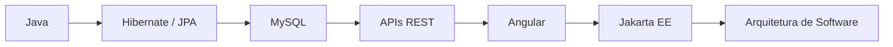

<h1 align="center">Olá, eu sou o José Gabriel Pereira da Silva 👋</h1>
<h3 align="center">Desenvolvedor focado em Java e aplicações Full Stack 🚀</h3>

<p align="center">
  
</p>

---

### 💫 Sobre Mim

```yaml
desenvolvedor:
  foco: [Java, Full Stack]
  paixao: "transformar ideias em sistemas funcionais"
  filosofia: "código limpo > código rápido, mas gosto dos dois"
```

- 💻 Desenvolvedor focado em **Java** e aplicações **Full Stack**
- 🧠 Sempre estudando algo novo, sempre construindo algo útil
- 🤝 Aberto a colaborações e trocas de conhecimento

---

### 🔥 Principais Tecnologias

<p align="left">
  
  
  
  
  
  
  
  
  
</p>

---

### 🧠 Atualmente Estudando

<p align="left">
  
  
  
  
</p>



---

### 🚓 Projetos em Destaque

<table>
  <tr>
    <td width="33%">
      <h4>🚗 CadCollections</h4>
      <p>Sistema de gerenciamento de colecionadores e carros.</p>
      <p><code>Flex</code> · <code>Java</code> · <code>Hibernate</code></p>
    </td>
    <td width="33%">
      <h4>📦 CadProd</h4>
      <p>CRUD completo de produtos com persistência de dados.</p>
      <p><code>JPA</code> · <code>Hibernate</code> · <code>MySQL</code></p>
    </td>
    <td width="33%">
      <h4>🖥️ Swing-JPA</h4>
      <p>Sistema desktop com interface gráfica e banco de dados.</p>
      <p><code>Java Swing</code> · <code>Hibernate</code> · <code>MySQL</code></p>
    </td>
  </tr>
</table>

---

### 📊 Estatísticas do GitHub

<p align="center">
  
  
</p>

<p align="center">
  
</p>

<p align="center">
  
</p>

<p align="center">
  
</p>

---

### 🏙️ GitHub City

<p align="center">
  
</p>

> ℹ️ Essa imagem é gerada automaticamente por uma **GitHub Action** rodando no seu próprio repositório `josegabrielprgm/josegabrielprgm`. Veja como configurar logo abaixo.

<details>
<summary>⚙️ Como ativar o GitHub City (clique para expandir)</summary>

1. No seu repositório especial `josegabrielprgm/josegabrielprgm`, crie o arquivo:
   `.github/workflows/profile-3d-contrib.yml`

2. Cole o conteúdo:

```yaml
name: GitHub 3D Contribution Calendar

on:
  schedule:
    - cron: "0 0 * * *" # roda todo dia à meia-noite
  workflow_dispatch:

jobs:
  build:
    runs-on: ubuntu-latest
    steps:
      - uses: actions/checkout@v4
      - uses: yoshi389111/github-profile-3d-contrib@0.7.1
        env:
          GITHUB_TOKEN: ${{ secrets.GITHUB_TOKEN }}
        with:
          username: josegabrielprgm
      - name: Commit & Push
        run: |
          git config user.name github-actions
          git config user.email github-actions@github.com
          git add -A .
          git commit -m "Atualiza GitHub City" || exit 0
          git push
```

3. Faça commit — a Action vai rodar automaticamente (ou clique em "Run workflow" manualmente pela aba **Actions**) e vai gerar os arquivos SVG dentro da pasta `profile-3d-contrib/`.

4. Temas disponíveis: troque `profile-night-rainbow.svg` por `profile-night-green.svg`, `profile-south.svg`, entre outros, conforme o que a Action gerar.

</details>

---

### ⚡ Fun Fact

```java
public class Dev {
    public static void main(String[] args) {
        boolean alive = true;
        while (alive) {
            code();
            learn();
            improve();
        }
    }
}
```

---

### 🌎 Conecte-se Comigo

<p align="left">
  <a href="mailto:josegabrielprgm@email.com">
    
  </a>
  <a href="https://github.com/josegabrielprgm" target="_blank">
    
  </a>
</p>

<p align="center">
  
</p>

<p align="center"><i>"while(alive) { code(); learn(); improve(); }"</i></p>
