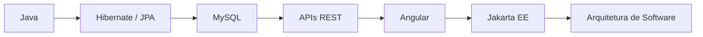

<h1 align="center">Olá, eu sou o José Gabriel Pereira da Silva 👋</h1>
<h3 align="center">Desenvolvedor focado em Java e aplicações Full Stack 🚀</h3>

<p align="center">
  
</p>

---

### 💫 Sobre Mim

```yaml
desenvolvedor:
  foco: [Java, Full Stack]
  paixao: "transformar ideias em sistemas funcionais"
  filosofia: "código limpo > código rápido, mas gosto dos dois"
```

- 💻 Desenvolvedor focado em **Java** e aplicações **Full Stack**
- 🧠 Sempre estudando algo novo, sempre construindo algo útil
- 🤝 Aberto a colaborações e trocas de conhecimento

---

### 🔥 Principais Tecnologias

<p align="left">
  
  
  
  
  
  
  
  
  
</p>

---

### 🧠 Atualmente Estudando

<p align="left">
  
  
  
  
</p>



---

### 🚓 Projetos em Destaque

<table>
  <tr>
    <td width="33%">
      <h4>🚗 CadCollections</h4>
      <p>Sistema de gerenciamento de colecionadores e carros.</p>
      <p><code>Flex</code> · <code>Java</code> · <code>Hibernate</code></p>
    </td>
    <td width="33%">
      <h4>📦 CadProd</h4>
      <p>CRUD completo de produtos com persistência de dados.</p>
      <p><code>JPA</code> · <code>Hibernate</code> · <code>MySQL</code></p>
    </td>
    <td width="33%">
      <h4>🖥️ Swing-JPA</h4>
      <p>Sistema desktop com interface gráfica e banco de dados.</p>
      <p><code>Java Swing</code> · <code>Hibernate</code> · <code>MySQL</code></p>
    </td>
  </tr>
</table>

---

### 📊 Estatísticas do GitHub

<p align="center">
  
  
</p>

<p align="center">
  
</p>

<p align="center">
  
</p>

---

### ⚡ Fun Fact

```java
public class Dev {
    public static void main(String[] args) {
        boolean alive = true;
        while (alive) {
            code();
            learn();
            improve();
        }
    }
}
```

---

### 🌎 Conecte-se Comigo

<p align="left">
  <a href="mailto:josegabrielprgm@email.com">
    
  </a>
  <a href="https://github.com/josegabrielprgm" target="_blank">
    
  </a>
</p>

<p align="center">
  
</p>

<p align="center"><i>"while(alive) { code(); learn(); improve(); }"</i></p>
