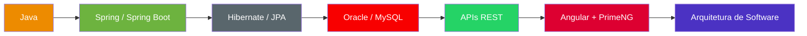

<div align="center">


<br/>

<a href="mailto:josegabrielprgm@email.com">
  
</a>
<a href="https://github.com/josegabrielprgm" target="_blank">
  
</a>


</div>

---

## 💫 Sobre Mim

```yaml
desenvolvedor:
  nome: "José Gabriel Pereira da Silva"
  foco: [Java, Spring, Angular, Full Stack]
  paixao: "transformar ideias em sistemas funcionais"
  filosofia: "código limpo > código rápido, mas gosto dos dois"
  status: "sempre_estudando: true"
```

- 💻 Desenvolvedor focado em **Java**, **Spring** e aplicações **Full Stack** com **Angular**
- 🧠 Sempre estudando algo novo, sempre construindo algo útil
- 🤝 Aberto a colaborações e trocas de conhecimento

---

## 🔥 Stack Completa

<div align="center">

</div>

<br/>

<p align="center">
  
  
  
  
  
</p>
<p align="center">
  
  
</p>
<p align="center">
  
  
</p>
<p align="center">
  
  
</p>
<p align="center">
  
  
  
  
</p>

---

## 🧠 Atualmente Estudando

<p align="center">
  
  
  
  
</p>


```mermaid
graph LR
    A[Java] --> B[Spring / Spring Boot]
    B --> C[Hibernate / JPA]
    C --> D[Oracle / MySQL]
    D --> E[APIs REST]
    E --> F[Angular + PrimeNG]
    F --> G[Arquitetura de Software]

    style A fill:#ED8B00,color:#fff
    style B fill:#6DB33F,color:#fff
    style C fill:#59666C,color:#fff
    style D fill:#F80000,color:#fff
    style E fill:#25D366,color:#fff
    style F fill:#DD0031,color:#fff
    style G fill:#4B32C3,color:#fff
```

---

## 🚓 Projetos em Destaque

<table>
  <tr>
    <td width="33%">
      <h4>🚗 <a href="https://github.com/josegabrielprgm/cad-prod-spring-angular">cad_prod</a></h4>
      <p>Sistema desenvolvido para fins de estudos.</p>
      <p><code>Java</code> · <code>Spring-boot</code></p>
    </td>
    <td width="33%">
      <h4>🖥️ <a href="https://github.com/josegabrielprgm/CarCollectionManager">CarCollectionManager</a></h4>
      <p>Aplicação desktop para gerenciamento de colecionadores e veículos.</p>
      <p><code>Java</code> · <code>Swing</code> · <code>JPA</code></p>
    </td>
    <td width="33%">
      <h4>👥 <a href="https://github.com/josegabrielprgm/PedidoPro">PedidoPro</a></h4>
        <p>Sistema de gerenciamento de pedidos desenvolvido com Java e Spring Boot. Possui clientes, produtos, categorias e pedidos, utilizando REST API, JPA/Hibernate, MySQL, DTOs, Mappers, validações e arquitetura em camadas. Projeto desenvolvido com foco em boas práticas e regras de negócio.</p>
      <p><code>Java</code> · <code>JPA</code> · <code>MySQL</code></p>
    </td>
  </tr>
</table>

<p align="center"><i>Assim que eu subir projetos com Angular e Spring, é só me avisar que atualizo essa seção.</i></p>

---

## 📊 Estatísticas do GitHub

<div align="center">


</div>


---

## ⚡ Fun Fact

```java
public class Dev {
    public static void main(String[] args) {
        boolean alive = true;
        while (alive) {
            code();
            learn();
            improve();
        }
    }
}
```

<div align="center">
<i>"while(alive) { code(); learn(); improve(); }"</i>
</div>


